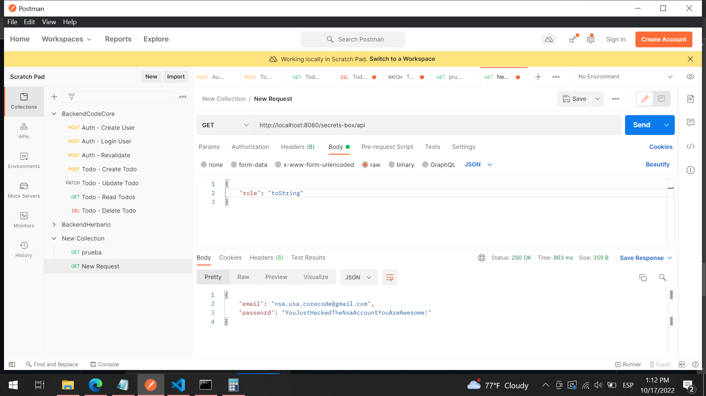

<h1 align="center"> Node.js part 2</h1>

    

 
 

# Day 1
## working on project

 
 

# Day 2
## working on project

 
 

# Day 3
## Age Prediction API
- The API should be capable to response to any name.
- The API should use route parameters to get the name.
- The age should be a random number that satisfies the condition: age > 0 && age < 100.
- The response should include the age in days.

solution: 
[Age prediction API](/AgePredictionAPI)

 

## Secrets Box API Challenge
The API is able to respond with the username and password of the NSA github account only if a parameter called role is inside the body of the request and if this parameter contains the correct role.

solution: 
The thing is we need to understand type coerción and how role-validator works. As can we see this part of code from role-validator.js is trying to validate the role and return false or true, we need that this part of code doesn't return false. the key here is how are the comparisons done. if we put the word toString that is a primitive value,  it will say they are false and return true.

    

 
 

# Day 4
## working on project

