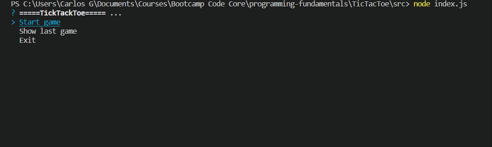

<h1 align="center"> Typescript part 5</h1>
<div align="center">
    
</div>

<br>
<br>

# Day 1
##  TicTacToe Exercise
<br>

### Description
You are working in a game company, and your task is to create a command line game, you decide to develop the famous Tic Tac Toe game.

Solution: [TicTacToe program](/TicTacToe/README.md)

<h2>TicTacToe</h2>


<br>

# Day 2
##  What is TypeScript and why would I use it in place of JavaScript?

TypeScript is a superset of the JavaScript language that has a single open-source compiler and is developed mainly by a single vendor: Microsoft. The goal of TypeScript is to help catch mistakes early through a type system and to make JavaScript development more efficient.

1. Support for modern JavaScript features - The JavaScript language (not the runtime) is standardized through the ECMAScript standards. Not all browsers and JavaScript runtimes support all features of all ECMAScript standards (see this overview). TypeScript allows for the use of many of the latest ECMAScript features and translates them to older ECMAScript targets of your choosing (see the list of compile targets under the --target compiler option).

2. Advanced type system - The type support is not part of the ECMAScript standard and will likely never be due to the interpreted nature instead of compiled nature of JavaScript. The type system of TypeScript is incredibly rich and includes: interfaces, enums, hybrid types, generics, union/intersection types, access modifiers and much more.

3. Developer tooling support - TypeScript's compiler can run as a background process to support both incremental compilation and IDE integration such that you can more easily navigate, identify problems, inspect possibilities and refactor your codebase.

<br>

# Day 4
## Mocke interview
### Tell me a bit about yourself

i´m a developer and also a science and systems engineering student who is in graduiting process developing a web page as a project. in this project i have used ReactJs/Tailwind, NodeJs and Mysql. i'm studing english at academia europea. i'm in a fundamentals bootcamp at core code and in the future i will look for a job as fullstack developer. 
<br>

### Hobbies
i like to play soccer, do exercise and watch comedy videos.

### How would you describe yourself in three words?
curious, self-taught and proactive.

### How do you see yourself in 5 years?
In fact i would like to work as a senior web developer. and i would like to work as a freelance 
to improve softskills and apply knowledge.

### Why do you want to work at this company?
They Partners with brands across high growth industry verticals.they offer competitive salaries and benefits, they want their people grow and develop both personally and professionally. They invest in the education of their team members.

### What do you know about this company?
i know that they work with international enterprises, they have an IT area and speak english is a requirement. they hire fullstack developers. 

### Why are you interested in this position?
i'm interested in this position because i have studied sciense andy sistem engeeniring i have completed some courses about this stack. I am self-taught, i always like to kwown more about technology.

### Why are you the ideal candidate for this position?
i have some experience in this area, i have worked with the tools that they use. i can communicate easyli with other people and i am a proactive person.

### What is your biggest strength? 
I think my greatest strength is being self-taught. If I don't know about a topic, I search and try to do it in the best way.

### What is your biggest flaw - weakness?
stay focused when there is noise

### How much salary do you expect?
i can say that a range could be 1500 - 2000 open to negociate.

# Day 5
## Training with codewars 
<br>

### Sums of Parts

Exercise:
Let us consider this example (array written in general format):

ls = [0, 1, 3, 6, 10]

Its following parts:

The corresponding sums are (put together in a list): [20, 20, 19, 16, 10, 0]

The function parts_sums (or its variants in other languages) will take as parameter a list ls and return a list of the sums of its parts as defined above.

```typescript
export function partsSums(ls: number[]): number[] {

}
```
Solution:
```typescript
/** return the output array and ignore all non-op characters */
export function partsSums(ls: number[]): number[] {
  let newArray: number[]= [];
  ls.reverse().reduce((pv, cv)=>{
      newArray.push(pv+cv);
      return pv+cv;}
  ,0);
  newArray.reverse();
  newArray.push(0);
  return newArray;
}
```
<br>

### Consecutive strings

Exercise:
You are given an array(list) strarr of strings and an integer k. Your task is to return the first longest string consisting of k consecutive strings taken in the array.

Examples:
strarr = ["tree", "foling", "trashy", "blue", "abcdef", "uvwxyz"], k = 2

Concatenate the consecutive strings of strarr by 2, we get:

treefoling   (length 10)  concatenation of strarr[0] and strarr[1]
folingtrashy ("      12)  concatenation of strarr[1] and strarr[2]
trashyblue   ("      10)  concatenation of strarr[2] and strarr[3]
blueabcdef   ("      10)  concatenation of strarr[3] and strarr[4]
abcdefuvwxyz ("      12)  concatenation of strarr[4] and strarr[5]

Two strings are the longest: "folingtrashy" and "abcdefuvwxyz".
The first that came is "folingtrashy" so 
longest_consec(strarr, 2) should return "folingtrashy".

In the same way:
longest_consec(["zone", "abigail", "theta", "form", "libe", "zas", "theta", "abigail"], 2) --> "abigailtheta"
n being the length of the string array, if n = 0 or k > n or k <= 0 return "" (return Nothing in Elm, "nothing" in Erlang).

```typescript
export function longestConsec(strarr: string[], k: number): string {
}
```
Solution:
```typescript
/** return the output array and ignore all non-op characters */
export function longestConsec(strarr: string[], k: number): string {
  if( strarr.length==0 || k>strarr.length || k<=0) return ""
  let newArray: string[]=[];
  let piv: string []=[strarr[0]];
  
  strarr.reduce((pv,cv)=>{
    while(piv.length>=k){
      piv.shift()
    }
    piv.push(cv);
    newArray.push(piv.join(''));
    return cv;
  })

  let max:string=newArray[0];
  for(let n of newArray ){
    if(n.length>max.length){
      max=n;
    }
  }
  return max;
}
```
<br>